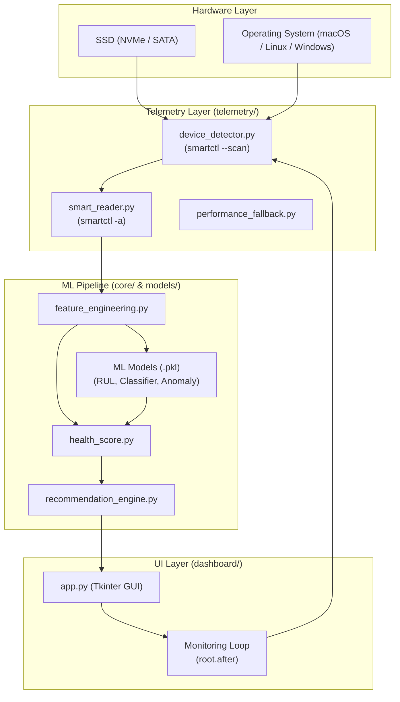

# NANDGuard System Architecture

NANDGuard is an AI-powered storage health monitor. This document describes the system architecture and data flow.

## Architecture Overview

## Component Breakdown

### 1. Telemetry Layer

- **device_detector.py**: Uses `smartctl --scan` and `psutil` to identify physical drives and their native paths (e.g., `/dev/disk0` or `/dev/sda`).
- **smart_reader.py**: Executes `smartctl -a` with specific device types (like `-d nvme`) and parses the raw output into standardized metrics.
- **performance_fallback.py**: Collects OS-level performance metrics as a backup in case hardware-level SMART data is unavailable.

### 2. ML Pipeline & Core Logic

- **feature_engineering.py**: Transforms raw SMART attributes (Temperature, Wear Level, Host Writes) into optimized features for ML inference.
- **ML Models**:
  - **RUL Model**: Predicts Remaining Useful Life in days (XGBoost).
  - **Classifier**: Categorizes health status (Healthy, Degrading, Critical) (RandomForest).
  - **Anomaly Detector**: Flags sub-optimal operating conditions (IsolationForest).
- **health_score.py**: Computes a final weighted health percentage by fusing results from the classifier, RUL, and wear-level metrics.
- **recommendation_engine.py**: Generates actionable advice based on health trends and detected anomalies.

### 3. Dashboard UI

- **app.py**: A professional Tkinter-based dashboard designed for cross-platform stability. It features a thread-safe monitoring loop using `root.after()` to ensure responsive updates without interfering with the GUI event loop.
