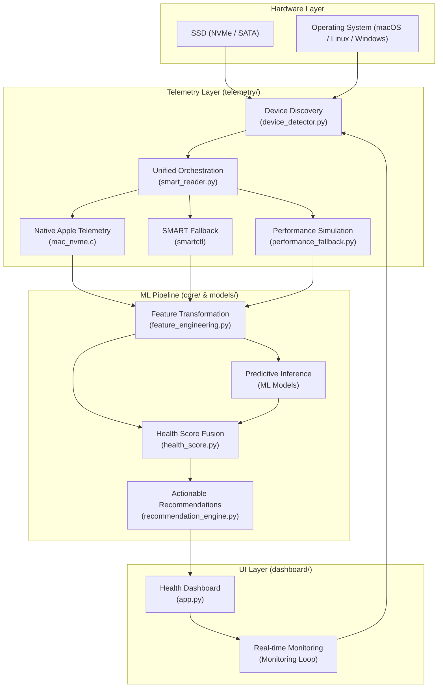

# NANDGuard System Architecture

NANDGuard is an AI-powered storage health monitor. This document describes the system architecture and data flow.

## Architecture Overview

## Component Breakdown

### 1. Telemetry Layer

- **Native Apple Telemetry (`mac_nvme.c`)**:
  - **IOKit Integration**: Communicates directly with the macOS I/O Registry using the `IOKit` framework to target `AppleANS3NVMeController` and `IONVMeBlockStorageDevice` services.
  - **Direct Memory Access**: Attempts to retrieve the raw 512-byte NVMe SMART Log Page directly from the kernel-level "SMART Data" property, bypassing the need for external CLI parsing.
  - **Kernel Stats Fallback**: If hardware SMART data is restricted, it queries the `IOBlockStorageDriver` for native `Statistics` (raw Bytes Read/Written), ensuring high-fidelity telemetry even under strict security policies.
- **Device Discovery (`device_detector.py`)**: Uses `smartctl --scan` and `psutil` to identify physical drives and their native paths (e.g., `/dev/disk0` or `/dev/sda`).
- **Unified Orchestration (`smart_reader.py`)**: Prioritizes the **Native C Bridge** for Apple Silicon, falls back to `smartctl -a` (handling macOS-specific warning codes), and triggers the **Synthetic Simulator** if no hardware is accessible.
- **performance_fallback.py**: Collects OS-level performance metrics as a backup in case hardware-level SMART data is unavailable.

### 2. ML Pipeline & Core Logic

- **feature_engineering.py**: Transforms raw SMART attributes (Temperature, Wear Level, Host Writes) into optimized features for ML inference.
- **ML Models**:
  - **RUL Model**: Predicts Remaining Useful Life in days (XGBoost).
  - **Classifier**: Categorizes health status (Healthy, Degrading, Critical) (RandomForest).
  - **Anomaly Detector**: Flags sub-optimal operating conditions (IsolationForest).
- **health_score.py**: Computes a final weighted health percentage by fusing results from the classifier, RUL, and wear-level metrics.
- **recommendation_engine.py**: Generates actionable advice based on health trends and detected anomalies.

### 3. Dashboard UI

- **app.py**: A professional Tkinter-based dashboard designed for cross-platform stability. It features a thread-safe monitoring loop using `root.after()` to ensure responsive updates without interfering with the GUI event loop.
