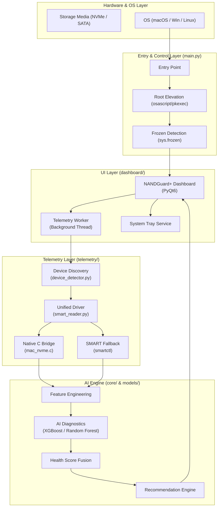

# NANDGuard+ System Architecture

NANDGuard+ is a professional-grade storage health utility powered by advanced ML diagnostics. This document outlines the multi-layered architecture that enables real-time monitoring, root-level hardware access, and cross-platform distribution.

## Architecture Overview

## Component Breakdown

### 1. Entry & Elevation Layer (`main.py`)

- **Root Authorization**: NANDGuard+ requires administrative privileges for low-level hardware access. `main.py` implements a secure elevation flow using `osascript` (macOS) or `pkexec` (Linux) to prompt the user for credentials at startup.
- **Environment Management**: Detects if the application is running in a **frozen** state (bundled .app/.exe) and bypasses development environment checks to ensure instant launch performance.

### 2. Telemetry Layer

- **Native C Bridge (`mac_nvme.c`)**: Communicates directly with Apple's IOKit registry to extract 512-byte SMART log pages from internal NVMe controllers, bypassing user-space limitations.
- **Device Discovery**: Dynamically identifies physical disks using a combination of `smartctl --scan` and `psutil`, ensuring hot-plugged devices are tracked.
- **Unified Driver (`smart_reader.py`)**: A multi-stage orchestration script that prioritizes Native C telemetry, falls back to `smartctl`, and handles macOS-specific SMART warning codes (e.g., Code 4).

### 3. AI & Core Logic

- **Predictive Inference**: Uses pre-trained XGBoost and Scikit-Learn models to calculate:
  - **Remaining Useful Life (RUL)**: Estimated days of operation left.
  - **Health Classification**: Categorizing drives into Healthy, Degrading, or Critical states.
- **Health Fusion**: Combines binary metrics (Temperature, Wear Level) with ML predictions to generate a single "Health Gauge" percentage (0-100%).

### 4. UI Layer (PyQt6 Dashboard)

- **Threaded Monitoring**: Telemetry is offloaded to a `TelemetryWorker` thread to keep the UI buttery smooth while intensive I/O operations occur in the background.
- **Enterprise Dark UI**: A high-fidelity, sidebar-based interface with interactive health gauges and clickable device cards.
- **System Tray Persistence**: NANDGuard+ runs as a background service in the system tray, providing persistent monitoring and native OS notifications for critical alerts.

### 5. Distribution Layer

- **Cross-Platform Bundling**: Utilizes custom PyInstaller `.spec` logic to bundle dynamic libraries (`libxgboost.dylib`) and system frameworks directly into standalone installers:
  - **macOS**: Drag-to-install `.dmg` with LaunchAgent support.
  - **Windows**: Wizard-based setup via **Inno Setup**.
  - **Linux**: Standard `.deb` packaging.
