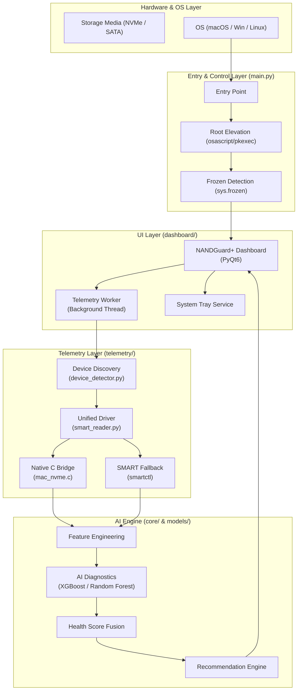

# NANDGuard – Smart Storage Health Monitor

NANDGuard is an AI-powered storage health monitoring system designed to simulate enterprise-grade SSD predictive maintenance. Built with a modular architecture, it combines hardware telemetry, machine learning, and a real-time dashboard to provide actionable health insights.


<p align="center">
  <em>Figure 1. NANDGuard main dashboard </em>
</p>


## ✨ Key Features

- **ML-Based Health Engine**: Predicts Remaining Useful Life (RUL), classifies health status (Healthy/Degrading/Critical), and detects anomalous telemetry patterns.
- **Real-Time Dashboard**: A professional GUI with gauges and continuous monitoring (updates every 30 seconds).
- **CLI Fallback Mode**: Automatically switches to terminal-based reporting on systems where a GUI environment is unavailable.
- **Cross-Platform Support**: Robust performance on macOS, Windows, and Linux.
- **Hardware Telemetry**: Deep integration with `smartctl` for hardware-level attributes (Power-on Hours, Wear Level, Media Errors, etc.).

## 🏗️ Architecture

NANDGuard follows a modular pipeline:

1. **Telemetry**: Discovers devices via `psutil` and ingests SMART data via `smartmontools`.
2. **Core Engine**: Performs feature engineering and generates a composite health score (0-100).
3. **ML Layer**: Utilizes pre-trained XGBoost, RandomForest, and IsolationForest models.
4. **Dashboard**: Unified interface for data visualization and continuous monitoring.





## ⚙️ Installation Guide

### 1. Prerequisites

- **Python 3.8+**
- **smartmontools**: Required for SMART telemetry.
  - **macOS**: `brew install smartmontools`
  - **Linux**: `sudo apt install smartmontools`
  - **Windows**: [Download installer](https://www.smartmontools.org/)

### 2. Clone and Pip Install

```bash
pip install -r requirements.txt
```

### 3. Tkinter Setup (For GUI Mode)

On macOS with Homebrew, you may need to install the Tkinter module separately:

```bash
brew install python-tk@3.13
```

## 🚀 How to Run

### Standard Launch (GUI)

```bash
python3 main.py
```

### CLI Fallback Mode

If you prefer terminal output or lack a GUI environment:

```bash
python3 main.py --cli
```

## 📂 Project Structure

```text
NANDGuard/
├── main.py             # App entry point & OS-aware orchestrator
├── requirements.txt    # Dependency list
├── core/               # Health scoring & recommendation logic
├── dashboard/          # Tkinter & CLI UI implementation
├── data/               # Synthetic dataset & generator scripts
├── models/             # Trained ML models (.pkl)
├── telemetry/          # Hardware discovery & SMART parsing
└── venv/               # (Optional) Virtual environment
```

## 📂 UI Design 

<p align="center">
  <em>Figure 2.1. NANDGuard main dashboard </em>
</p>

<p align="center">
  <em>Figure 2.2. Drive Details </em>
</p>

<p align="center">
  <em>Figure 2.3. Drive Diagnosis </em>
</p>

<p align="center">
  <em>Figure 2.4. History - Health Over Time </em>
</p>

<p align="center">
  <em>Figure 2.5. </em>
</p>


## ⚠️ Disclaimer

This is a prototype. In the absence of live hardware or `smartctl` support, NANDGuard utilizes a **Synthetic NAND Degradation Simulator** to demonstrate the AI engine's predictive capabilities.

---

